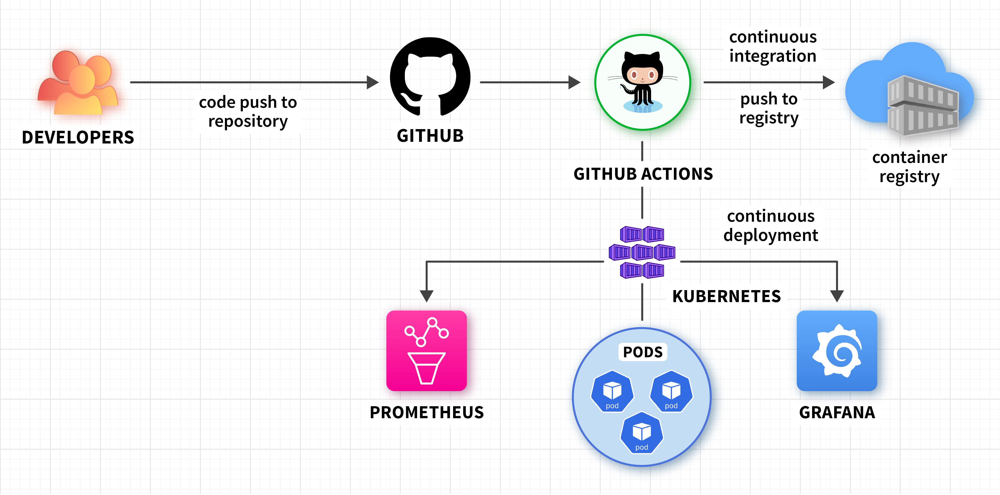

# Kubernetes-Cluster-and-GitHub-Actions

# Prequisites 
1. GitHub account
2. Kubernetes cluster
3. Docker hub
4. IDE (visual studio code).

# Step 1
* Create a Node.js web application

# Step 2
* Create a package.json file to manage dependencies

# Step 3
* Build a docker image

# Step 4
* Create a k8s deployment manifest

# Step 6
* Create a GitHub actions workflow

# Step 7
* Push code to GitHub repo

# Architectural diagram

